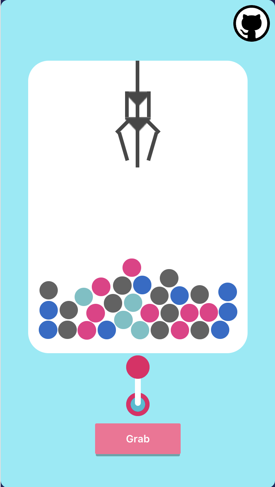

# Luckydraw-react

Control the joystick and move it to your chosen angle or position.
Press GRAB! to drop the claw and try to grab a ball.

	

Lucky Draw made using react.js.
The original implementation is written in the context of a react-native app.
With the help of [react-native-web](https://necolas.github.io/react-native-web/), it is ported into this web version.

The app is made using various libs, including [react-game-engine](https://github.com/bberak/react-game-engine), [matter.js](https://github.com/liabru/matter-js), [react-awesome-button](https://github.com/rcaferati/react-awesome-button) and [spinners-react](https://github.com/adexin/spinners-react).

Interesting concept to learn: [Entity Component System](https://en.wikipedia.org/wiki/Entity_component_system) in [react-game-engine](https://github.com/bberak/react-game-engine).

This project was bootstrapped with [Create React App](https://github.com/facebook/create-react-app).
